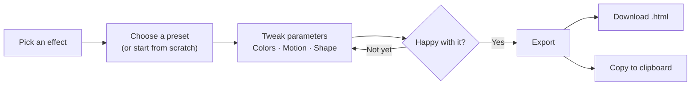

# FX Export

**Create stunning animated backgrounds for your designs — and export them as drop-in HTML files.**

[**Try it live →**](https://narenkatakam.github.io/fx-export/)

FX Export is a browser-based tool that gives designers access to GPU-powered visual effects — gradient meshes, fluid surfaces, wave patterns, and crystalline textures — all rendered in real-time with WebGL. Tweak colors, motion, and material properties until it looks right, then export a single HTML file you can drop into any project. No dependencies. No build step. Just a beautiful background.

---

## What is FX Export?

Most background generators give you static gradients or basic CSS patterns. FX Export goes further — it runs real GLSL shaders in your browser, producing effects that feel alive: light refracts, surfaces ripple, colors morph.

### Four shader effects, each with curated presets

| Effect | What it does | Example presets |
|--------|-------------|----------------|
| **Gradient Mesh** | Smooth, morphing color blobs that drift and blend | Sunset Drift, Northern Lights, Cotton Candy |
| **Fluid Surface** | Organic 3D fluid with metallic reflections and depth | Molten Gold, Deep Ocean, Black Chrome |
| **Wave Ripples** | Interference patterns with caustic light effects | Deep Pool, Moonlit Water, Lava Ripples |
| **Voronoi Glass** | Crystalline cell patterns with refraction and glow | Ice Crystal, Stained Glass, Honeycomb |

### What you control

Every effect exposes real shader parameters — not abstract "style 1, style 2" toggles:

- **Colors** — pick exact colors for gradients, surfaces, and edges
- **Motion** — speed, complexity, warp intensity
- **Shape** — scale, frequency, cell density, wave count
- **Material** — metallic, roughness, glossiness (Fluid Surface)
- **Effects** — bloom, parallax, refraction, caustic intensity

### What you get

A **single `.html` file** (~15–25 KB) that runs anywhere. No React, no npm, no framework. Just open it in a browser or embed it in your site. You can export with or without animation, and at any resolution up to 8K.

---

## How to Use It

### Quick start

1. Open [**fx-export**](https://narenkatakam.github.io/fx-export/)
2. Pick an effect from the dropdown
3. Browse presets or dial in your own look
4. Hit **Export** → download or copy to clipboard

### The workflow

### Use cases

**Hero backgrounds for landing pages**
Pick Gradient Mesh with your brand colors. Export with animation on. Drop the HTML into an iframe or embed it behind your hero text. Instant visual depth without loading a video.

**Presentation slides**
Export a Fluid Surface at 1920×1080 with animation off. You get a static but richly textured background image (rendered as a canvas) that's sharper than any stock texture.

**Social media assets**
Use Voronoi Glass or Wave Ripples as a backdrop. Screenshot or export at your target resolution. The organic patterns make text pop without competing for attention.

**Loading screens and ambient UI**
Export with animation on and embed as a full-screen background. The GPU-rendered animation runs smoothly at 60fps with minimal CPU overhead.

### Keyboard shortcuts

| Key | Action |
|-----|--------|
| `H` | Toggle the control panel |
| `Esc` | Close the export modal |

### Export options

| Setting | Options |
|---------|---------|
| **Canvas size** | 320×240 up to 7680×4320 (8K) |
| **Animation** | On (looping) or Off (static frame) |
| **Output** | Download as `.html` file or copy to clipboard |

---

## Technical details

Built with TypeScript, Vite, and raw WebGL — no Three.js, no Canvas2D. Effects are written as GLSL fragment shaders with multi-pass bloom post-processing. The export system inlines everything into a self-contained HTML file with zero external dependencies.

**Browser support:** Any modern browser with WebGL (Chrome, Firefox, Safari, Edge).

---

Made by [Naren Katakam](https://narenkatakam.com)
